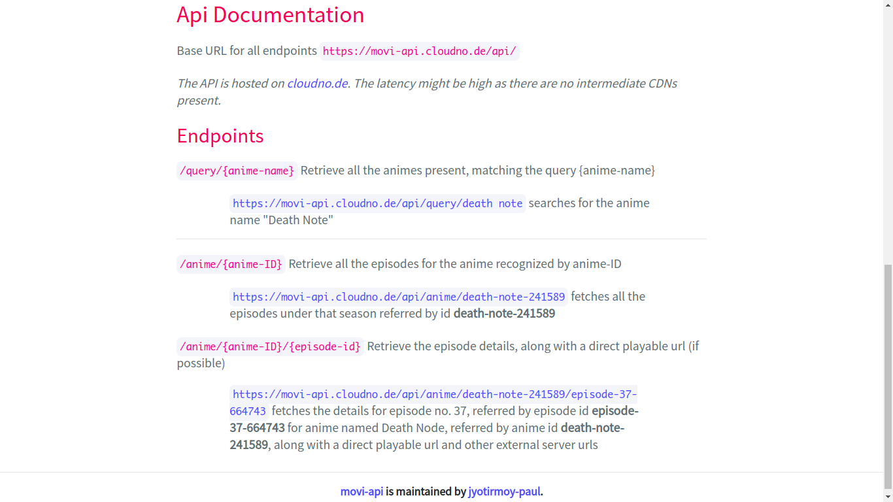

# movi
[](https://app.netlify.com/sites/movi-anime/deploys)

Then anime streaming app

## Table of Contents
- [movi-api](#movi-api)
- [movi-web](#movi-web)
- [movi-app](#movi-app)
- [License](#license)
- [Contributing to movi](#contributing-to-movi)


## movi-api
#### The movi-api can be found [here](https://movi-api.cloudno.de/)
This app build with Node.js, scrapes the anime website (here, kickassanime) to fetch you a simple API for quering anime names, seasons and episodes. The API also exposes you the direct playable video URL. [Details here](https://github.com/jyotirmoy-paul/movi/tree/master/movi-api)

### Documentation



### JSON Response

#### Make your own request [query for "Death Note"](https://movi-api.cloudno.de/api/query/death+note)
The JSON Response for querying for an anime named "Death Note" is shown as below


## movi-web

#### The movi-web can be found [here](https://movi-anime.netlify.app/)
The movi-web is build with react. [Details here](https://github.com/jyotirmoy-paul/movi/tree/master/movi-web)<br>
A sample search for "boku no hero" on the movi-web is shown below


## movi-app
The mobile app is built with flutter framework. [Details here](https://github.com/jyotirmoy-paul/movi/tree/master/movi-app)<br>
The episode search screen for the anime "Death Note" is shown below


## License
```
MIT License

Copyright (c) 2019 Jyotirmoy Paul

Permission is hereby granted, free of charge, to any person obtaining a copy
of this software and associated documentation files (the "Software"), to deal
in the Software without restriction, including without limitation the rights
to use, copy, modify, merge, publish, distribute, sublicense, and/or sell
copies of the Software, and to permit persons to whom the Software is
furnished to do so, subject to the following conditions:

The above copyright notice and this permission notice shall be included in all
copies or substantial portions of the Software.

THE SOFTWARE IS PROVIDED "AS IS", WITHOUT WARRANTY OF ANY KIND, EXPRESS OR
IMPLIED, INCLUDING BUT NOT LIMITED TO THE WARRANTIES OF MERCHANTABILITY,
FITNESS FOR A PARTICULAR PURPOSE AND NONINFRINGEMENT. IN NO EVENT SHALL THE
AUTHORS OR COPYRIGHT HOLDERS BE LIABLE FOR ANY CLAIM, DAMAGES OR OTHER
LIABILITY, WHETHER IN AN ACTION OF CONTRACT, TORT OR OTHERWISE, ARISING FROM,
OUT OF OR IN CONNECTION WITH THE SOFTWARE OR THE USE OR OTHER DEALINGS IN THE
SOFTWARE.
```

## Contributing to movi
All pull requests are welcome
